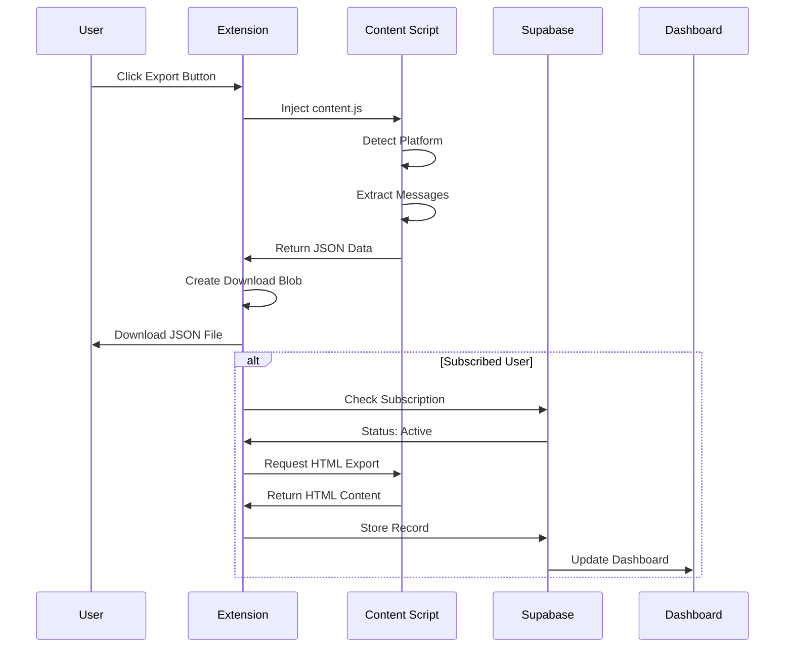
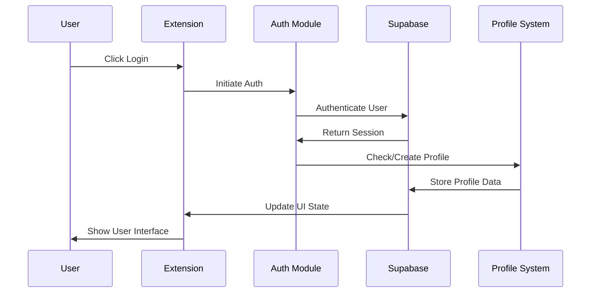

# 🏗️ Chat Exporter Architecture Review

## 📋 Executive Summary

This document provides a comprehensive architectural review of the Chat Exporter browser extension, analyzing its modular design, data flows, security implementation, and operational patterns across three distinct user experience tiers.

## 🎯 Architecture Overview

The Chat Exporter implements a **freemium SaaS model** through a browser extension with **progressive feature enhancement** based on user authentication and subscription status.

### Core Design Principles
- **Privacy-First**: Core functionality works without data transmission
- **Progressive Enhancement**: Features unlock with authentication/subscription
- **Platform Agnostic**: Supports multiple AI chat platforms
- **Modular Architecture**: Clear separation of concerns across modules

## 🏛️ System Architecture

### Module Breakdown

| Module | Files | Responsibility | Dependencies |
|--------|-------|---------------|--------------|
| **Extension Core** | `manifest.json`, `popup.html/js` | UI orchestration, permissions | Chrome APIs |
| **Authentication** | `auth.js` | Identity management, subscription tracking | Supabase Auth |
| **Content Extraction** | `content.js` | Platform-specific conversation parsing | DOM APIs |
| **Dashboard** | `dashboard/` | Premium feature interface | Supabase Database |
| **Database** | `prepal_migration.sql` | Data persistence, user management | PostgreSQL/Supabase |

### Technology Stack
- **Frontend**: Vanilla JavaScript, HTML5, CSS3
- **Backend**: Supabase (PostgreSQL + Auth + Storage)
- **Payment**: Stripe Checkout
- **Browser APIs**: Chrome Extension APIs v3
- **Authentication**: Supabase Auth (Email, Google, Apple OAuth)

## 🔄 Data Flow Architecture

### Three-Tier User Experience

#### Tier 1: Anonymous Users (Free)
```
AI Platform → Content Extraction → JSON Format → Local Download
```
- **Processing**: 100% local
- **Storage**: None
- **Privacy**: Maximum
- **Features**: Basic export

#### Tier 2: Authenticated Users (Freemium)
```
Login → Profile Creation → Enhanced UI → Basic Export + Upgrade Prompts
```
- **Processing**: Local + profile management
- **Storage**: User profile only
- **Privacy**: High
- **Features**: Basic export + subscription path

#### Tier 3: Subscribed Users (Premium)
```
Login → Subscription Verification → Dual Export → Cloud Storage → Dashboard Access
```
- **Processing**: Local + cloud backup
- **Storage**: Full conversation history
- **Privacy**: Controlled with RLS
- **Features**: Complete feature set

## 🔧 Technical Implementation

### Content Extraction Engine

The system implements platform-specific extractors for major AI chat platforms:

```javascript
// Platform detection and extraction routing
const extractors = {
  'chatgpt.com': extractChatGPTConversation,
  'claude.ai': extractClaudeConversation,
  'gemini.google.com': extractGeminiConversation,
  'chat.deepseek.com': extractDeepSeekConversation,
  'aistudio.google.com': extractAIStudioConversation
};
```

#### Platform-Specific Implementations

| Platform | Extraction Method | Key Selectors | Special Features |
|----------|------------------|---------------|------------------|
| **ChatGPT** | Turn-based parsing | `article[data-testid^="conversation-turn-"]` | Message role attributes |
| **Claude** | Container-based | `[data-testid="conversation"]` | Thinking/reasoning blocks |
| **Gemini** | Timeline ordering | `.conversation-container` | Vertical position sorting |
| **DeepSeek** | Structure-based | `.chat-container` | Reasoning extraction |
| **AI Studio** | Component-based | Angular selectors | Component hierarchy |

### Database Schema Design

```sql
-- User management with subscription tracking
profiles {
  id: uuid PRIMARY KEY → auth.users(id)
  subscription_status: enum('active', 'inactive', 'cancelled')
  created_at: timestamp
}

-- Conversation storage with dual format support
records {
  id: bigint PRIMARY KEY
  user_id: uuid → profiles(id)
  title: text
  content_type: enum('json', 'html')
  html_content: text        -- Rich formatted conversation
  json_data: jsonb         -- Structured data
  created_at: timestamp
}

-- Purchase tracking for subscription management
purchases {
  id: bigint PRIMARY KEY
  user_id: uuid → profiles(id)
  product: text
  amount: numeric(10,2)
  created_at: timestamp
}
```

### Security Implementation

#### Row Level Security (RLS) Policies
```sql
-- Users can only access their own data
CREATE POLICY "profiles_own_data" ON profiles
  FOR ALL USING (auth.uid() = id);

CREATE POLICY "records_own_data" ON records
  FOR ALL USING (auth.uid() = user_id);

CREATE POLICY "purchases_own_data" ON purchases
  FOR ALL USING (auth.uid() = user_id);
```

#### Privacy Protection Layers
1. **Local Processing**: Core functionality requires no server communication
2. **Authentication Gates**: Premium features require proper authentication
3. **Subscription Verification**: Cloud features require active subscription
4. **Data Isolation**: RLS ensures user data separation
5. **Minimal Collection**: Only store data necessary for requested features

## 🚀 Operational Flows

### Export Operation Sequence



### Authentication Flow



## 📊 Performance Characteristics

### Resource Usage
- **Memory**: Minimal footprint, content scripts loaded on-demand
- **Network**: Zero for anonymous users, minimal for authenticated users
- **Storage**: Local storage for preferences, cloud storage for premium features
- **CPU**: Lightweight DOM parsing, efficient message extraction

### Scalability Considerations
- **User Growth**: Supabase handles authentication and database scaling
- **Platform Support**: Modular extractor design allows easy platform addition
- **Feature Expansion**: Clean separation enables independent module development
- **Geographic Distribution**: Supabase provides global edge network

## 🛡️ Security Assessment

### Threat Model Analysis

| Threat | Mitigation | Implementation |
|--------|------------|----------------|
| **Data Interception** | Local processing | No network transmission for core features |
| **Unauthorized Access** | Authentication gates | Supabase Auth + RLS policies |
| **Data Leakage** | User isolation | Row Level Security enforcement |
| **Payment Fraud** | Secure processing | Stripe integration with webhooks |
| **Extension Tampering** | Code integrity | Browser extension security model |

### Privacy Compliance
- **GDPR**: User data control, deletion rights, minimal collection
- **CCPA**: Data transparency, user access rights
- **SOC 2**: Supabase compliance for data handling
- **Browser Security**: Extension manifest v3 compliance

## 🔍 Code Quality Assessment

### Strengths
- **Modular Design**: Clear separation of concerns
- **Progressive Enhancement**: Graceful feature degradation
- **Error Handling**: Comprehensive error catching and user feedback
- **Platform Abstraction**: Unified interface for multiple AI platforms
- **Security-First**: Privacy protection built into architecture

### Areas for Improvement
- **Testing Coverage**: Add comprehensive unit and integration tests
- **Error Recovery**: Enhanced fallback mechanisms for extraction failures
- **Performance Monitoring**: Add metrics for extraction success rates
- **Documentation**: Expand inline code documentation
- **Accessibility**: Improve UI accessibility features

## 🚀 Deployment Architecture

### Environment Configuration
```javascript
// Development
SUPABASE_URL: 'https://dev-project.supabase.co'
STRIPE_KEY: 'pk_test_...'

// Production
SUPABASE_URL: 'https://prod-project.supabase.co'
STRIPE_KEY: 'pk_live_...'
```

### Release Pipeline
1. **Development**: Local testing with test Supabase instance
2. **Staging**: Full feature testing with production-like data
3. **Production**: Browser store deployment with production keys
4. **Monitoring**: Error tracking and usage analytics

## 📈 Business Model Analysis

### Revenue Streams
- **Subscription Fees**: Monthly/annual premium subscriptions
- **Enterprise Plans**: Custom features for business users
- **API Access**: Programmatic access to export functionality

### Value Proposition by Tier
- **Free**: Privacy-focused local export
- **Premium**: Cloud backup and history management
- **Enterprise**: Team features and admin controls

## 🔮 Future Considerations

### Scalability Roadmap
- **Platform Expansion**: Add support for new AI chat platforms
- **Feature Enhancement**: Advanced search, filtering, analytics
- **Integration Options**: Export to external services (Notion, Google Drive)
- **Mobile Support**: React Native or PWA implementation

### Technical Debt Management
- **Testing Infrastructure**: Implement comprehensive test suite
- **Performance Optimization**: Optimize extraction algorithms
- **Code Modernization**: Migrate to TypeScript for better type safety
- **Documentation**: Create comprehensive developer documentation

## ✅ Conclusion

The Chat Exporter architecture successfully implements a **privacy-first, freemium SaaS model** with clear value progression across user tiers. The modular design enables independent development and scaling of features while maintaining security and privacy standards.

### Key Architectural Strengths
1. **Privacy Protection**: Core functionality works without data transmission
2. **Progressive Enhancement**: Clear upgrade path with tangible benefits
3. **Platform Agnostic**: Unified interface across multiple AI platforms
4. **Security-First**: Comprehensive protection at all levels
5. **Scalable Design**: Modular architecture supports growth

The implementation provides a solid foundation for a sustainable business model while respecting user privacy and providing clear value at each subscription tier.

## 📋 Technical Specifications

### Browser Extension Manifest
```json
{
  "manifest_version": 3,
  "permissions": ["activeTab", "downloads", "scripting"],
  "host_permissions": [
    "https://chat.openai.com/*",
    "https://claude.ai/*",
    "https://gemini.google.com/*",
    "https://chat.deepseek.com/*",
    "https://aistudio.google.com/*",
    "https://chatgpt.com/*",
    "https://*.supabase.co/*"
  ]
}
```

### API Endpoints
- **Authentication**: Supabase Auth API
- **Database**: Supabase REST API with RLS
- **Payments**: Stripe Checkout API
- **Storage**: Supabase Storage (future file uploads)

### Data Formats

#### JSON Export Format
```json
{
  "messages": [
    {
      "role": "user|assistant",
      "content": [{"type": "text", "text": "message content"}],
      "metadata": {
        "model": "gpt-4",
        "timestamp": "2024-01-01T00:00:00Z",
        "reasoning": "thinking process"
      }
    }
  ]
}
```

#### HTML Export Format
```html
<!DOCTYPE html>
<html>
<head>
  <title>Chat Export - {timestamp}</title>
  <style>/* Conversation styling */</style>
</head>
<body>
  <h1>Chat Export</h1>
  <div class="conversation">{extracted_html}</div>
</body>
</html>
```

## 🧪 Testing Strategy

### Test Coverage Areas
1. **Unit Tests**: Individual function testing
2. **Integration Tests**: Module interaction testing
3. **E2E Tests**: Full user workflow testing
4. **Platform Tests**: Cross-platform extraction validation
5. **Security Tests**: Authentication and authorization validation

### Test Implementation Plan
```javascript
// Example test structure
describe('Content Extraction', () => {
  test('ChatGPT extraction', () => {
    // Mock DOM structure
    // Test extraction function
    // Validate output format
  });

  test('Claude extraction', () => {
    // Platform-specific tests
  });
});

describe('Authentication Flow', () => {
  test('User signup', () => {
    // Test profile creation
    // Validate subscription status
  });
});
```

## 🔧 Development Guidelines

### Code Standards
- **JavaScript**: ES6+ features, async/await patterns
- **Error Handling**: Try-catch blocks with user-friendly messages
- **Logging**: Console logging for debugging, structured for production
- **Comments**: JSDoc format for function documentation

### Git Workflow
```bash
# Feature development
git checkout -b feature/new-platform-support
git commit -m "feat: add support for new AI platform"
git push origin feature/new-platform-support

# Create PR with comprehensive description
# Merge after review and testing
```

### Release Process
1. **Version Bump**: Update manifest.json version
2. **Changelog**: Document new features and fixes
3. **Testing**: Run full test suite
4. **Package**: Create extension package
5. **Deploy**: Submit to browser stores
6. **Monitor**: Track adoption and error rates

## 📊 Metrics & Monitoring

### Key Performance Indicators
- **User Adoption**: Daily/monthly active users
- **Conversion Rate**: Free to premium subscription rate
- **Platform Coverage**: Successful extraction rate per platform
- **Error Rate**: Failed extraction attempts
- **User Retention**: Subscription renewal rates

### Monitoring Implementation
```javascript
// Error tracking
try {
  const conversation = extractConversation();
} catch (error) {
  console.error('Extraction failed:', error);
  // Send to monitoring service
  trackError('extraction_failed', {
    platform: getPlatform(),
    error: error.message
  });
}

// Usage analytics
trackEvent('conversation_exported', {
  platform: getPlatform(),
  user_tier: getUserTier(),
  message_count: conversation.messages.length
});
```

## 🔒 Security Checklist

### Pre-Deployment Security Review
- [ ] **Input Validation**: All user inputs sanitized
- [ ] **Authentication**: Proper session management
- [ ] **Authorization**: Feature access controls implemented
- [ ] **Data Protection**: Encryption in transit and at rest
- [ ] **Privacy**: Minimal data collection principles
- [ ] **Compliance**: GDPR/CCPA requirements met
- [ ] **Vulnerability Scan**: No known security issues
- [ ] **Dependency Audit**: All dependencies up to date

### Ongoing Security Practices
- **Regular Updates**: Keep dependencies current
- **Security Monitoring**: Track authentication attempts
- **Access Logging**: Log all database access
- **Incident Response**: Plan for security incidents

## 🌟 Success Metrics

### Technical Success Indicators
- **Extraction Accuracy**: >95% successful conversation extraction
- **Performance**: <2 second export time
- **Reliability**: <1% error rate across platforms
- **Security**: Zero data breaches
- **Scalability**: Support for 10,000+ concurrent users

### Business Success Indicators
- **User Growth**: 20% month-over-month growth
- **Conversion Rate**: 5% free-to-premium conversion
- **Retention**: 80% monthly subscription retention
- **Platform Coverage**: Support for top 10 AI platforms
- **Customer Satisfaction**: >4.5/5 user rating

---

## 📝 Review Summary

This architecture review confirms that the Chat Exporter implements a **well-designed, secure, and scalable solution** that successfully balances user privacy with business objectives. The modular architecture, progressive feature enhancement, and security-first approach provide a solid foundation for sustainable growth.

### Recommended Next Steps
1. **Implement comprehensive testing suite**
2. **Add performance monitoring and analytics**
3. **Expand platform support based on user demand**
4. **Develop enterprise features for business users**
5. **Create detailed developer documentation**

The architecture is **production-ready** and positioned for successful market deployment.
